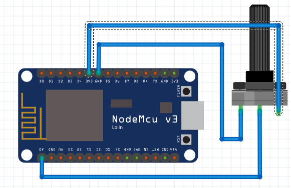
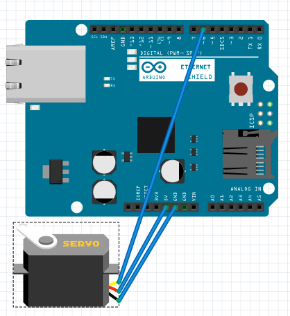

Playing with Raspberry Pi, Arduino, NodeMcu and MQTT
======

This days I'm playing with IoT. Today I want to use MQTT protocol to comunicate between different devices. First I've start a mqtt broker in my Laptop. For testing I'll use https://mosquitto.org/ server. In production we can use RabbitMQ or even a 3party server such a iot.eclipse.org or even Amazon's IoT.

The idea is emit one value with one device and listen this value whit the rest of devices and perform one action depending on the value. For example I will use one potentiometer connected to on NodeMcu micro controller. 



This controller will connect to the mqtt broker and will emit the value of the potentiometer (reading the analog input) into one topic (called "potentiometer"). We can code our NodeMcu with Lua but I'm more confortable with C++ and Arduino IDE. First I need to connect to my Wifi and then connect to broker and start emiting potentiometer's values

```c
#include <PubSubClient.h>
#include <ESP8266WiFi.h>

// Wifi configuration
const char* ssid = "MY_WIFI_SSID";
const char* password = "my_wifi_password";

// mqtt configuration
const char* server = "192.168.1.104";
const char* topic = "potentiometer";
const char* clientName = "com.gonzalo123.nodemcu";

int value;
int percent;
String payload;

WiFiClient wifiClient;
PubSubClient client(wifiClient);

void wifiConnect() {
  Serial.println();
  Serial.print("Connecting to ");
  Serial.println(ssid);

  WiFi.begin(ssid, password);

  while (WiFi.status() != WL_CONNECTED) {
    delay(500);
    Serial.print(".");
  }
  Serial.println("");
  Serial.print("WiFi connected.");
  Serial.print("IP address: ");
  Serial.println(WiFi.localIP());

  if (client.connect(clientName)) {
    Serial.print("Connected to MQTT broker at ");
    Serial.print(server);
    Serial.print(" as ");
    Serial.println(clientName);
    Serial.print("Topic is: ");
    Serial.println(topic);
  }
  else {
    Serial.println("MQTT connect failed");
    Serial.println("Will reset and try again...");
    abort();
  }
}

void mqttReConnect() {
  while (!client.connected()) {
    Serial.print("Attempting MQTT connection...");
    // Attempt to connect
    if (client.connect(clientName)) {
      Serial.println("connected");
      client.subscribe(topic);
    } else {
      Serial.print("failed, rc=");
      Serial.print(client.state());
      Serial.println(" try again in 5 seconds");
      delay(5000);
    }
  }
}

void setup() {
  Serial.begin(9600);
  client.setServer(server, 1883);
  wifiConnect();
  delay(10);
}

void loop() {
  value = analogRead(A0);
  percent = (int) ((value * 100) / 1010);
  payload = (String) percent;
  if (client.connected()) {
    if (client.publish(topic, (char*) payload.c_str())) {
      Serial.print("Publish ok (");
      Serial.print(payload);
      Serial.println(")");
    } else {
      Serial.println("Publish failed");
    }
  } else {
    mqttReConnect();
  }

  delay(200);
}
```

Now we will use another Arduino (with a ethernet shield).



We'll move one servomotor depending to NodeMcu's potentiomenter value. This Arduino only needs to listen to MQTT's topic and move the servo.

```c
#include <SPI.h>
#include <Servo.h>
#include <Ethernet.h>
#include <PubSubClient.h>

#define SERVO_CONTROL 9
byte mac[] = { 0xDE, 0xAD, 0xBE, 0xEF, 0xFE, 0xED };

Servo servo;
EthernetClient ethClient;

// mqtt configuration
const char* server = "192.168.1.104";
const char* topic = "potentiometer";
const char* clientName = "com.gonzalo123.arduino";

PubSubClient client(ethClient);

void callback(char* topic, byte* payload, unsigned int length) {
  Serial.print("Message arrived [");
  Serial.print(topic);
  Serial.print("] angle:");

  String data;
  for (int i = 0; i < length; i++) {
    data += (char)payload[i];
  }

  double angle = ((data.toInt() * 180) / 100);
  constrain(angle, 0, 180);
  servo.write((int) angle);
  Serial.println((int) angle);
}

void mqttReConnect() {
  while (!client.connected()) {
    Serial.print("Attempting MQTT connection...");
    // Attempt to connect
    if (client.connect(clientName)) {
      Serial.println("connected");
      client.subscribe(topic);
    } else {
      Serial.print("failed, rc=");
      Serial.print(client.state());
      Serial.println(" try again in 5 seconds");
      delay(5000);
    }
  }
}

void setup()
{
  Serial.begin(9600);
  client.setServer(server, 1883);
  client.setCallback(callback);
  servo.attach(SERVO_CONTROL);
  if (Ethernet.begin(mac) == 0) {
    Serial.println("Failed to configure Ethernet using DHCP");
  }

  delay(1500); // Allow the hardware to sort itself out
}

void loop()
{
  if (!client.connected()) {
    mqttReConnect();
  }
  client.loop();
}
```

Finally we'll use one Raspberry Pi with a Sense Hat and we'll display within its led matrix different colors and dots depending on the NodeMcu's value. In the same way than the Arduino script here we only need to listen to the broker's topic and perform the actions with the sense hat.

```python
import paho.mqtt.client as mqtt
from sense_hat import SenseHat

sense = SenseHat()
sense.clear()
mqttServer = "192.168.1.104"

red = [255, 0, 0]
green = [0, 255, 0]
yellow = [255, 255, 0]
black = [0, 0, 0]

def on_connect(client, userdata, rc):
    print("Connected!")
    client.subscribe("potentiometer")

def on_message(client, userdata, msg):
    value = (64 * int(msg.payload)) / 100
    O = black
    if value < 21:
        X = red
    elif value < 42:
        X = yellow
    else:
        X = green

    sense.set_pixels(([X] * value) + ([O] * (64 - value)))

client = mqtt.Client()
client.on_connect = on_connect
client.on_message = on_message

client.connect(mqttServer, 1883, 60)
client.loop_forever()
```


# Hardware:
* 1 Arduino Uno
* 1 NodeMCU (V3)
* 1 potentiometer
* 1 Servo (SG90)
* 1 Raspberry Pi 3 (with a Sense Hat)

# Demo
[](https://www.youtube.com/watch?v=28ylDY4LzB0)